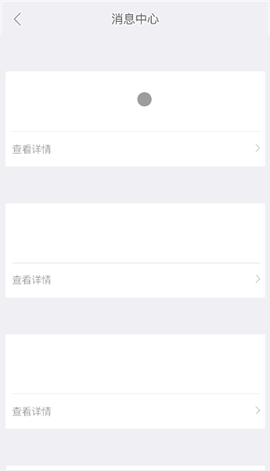

# vue-quick-loadmore
[](https://travis-ci.org/duyanpeng/vue-simple-picker)


基于vue的移动端下拉刷新上拉无限滚动加载的高度定制化插件

默认样式：可自定义更改添加loading图,自定义修改文案




## 安装
---
`npm install vue-quick-loadmore -S`

```
// 引入方式
import Vue from 'vue';
import VueQuickLoadmore from 'vue-quick-loadmore';

Vue.use(VueQuickLoadmore)
```

## 使用
---
```html
<template>
    <div id="app">
    <!-- 注意：quick-loadmore要求外面包裹容器(本例#app)
    的高度固定且overflow:hidden,并且quick-loadmore内部数据的高度要大于包裹容器的高度,
    才能触发quick-loadmore的上拉加载功能 -->
        <quick-loadmore :top-method="handleTop" ref="vueLoad" 
                        :top-status-change="handleStatusChange" 
                        :bottom-method="handleBottom" 
                        :bottom-status-change="handleBottomStatusChange" 
                        :disable-top="false" :disable-bottom="false">
            <div class="item" v-for="(item,index) in dataList" :key="index">{{index}}</div>
        </quick-loadmore>
    </div>
</template>
```
```javascript
export default {
  name: "Message",
  data() {
    return {
      dataList: [1, 2, 3, 4, 5]
    };
  },
  // 实现进入详情页返回列表位置功能-搭配keep-alive
  beforeRouteLeave(to, from, next) {
    // 如果进入详情页
    if (to.name === "MessageDetail") {
        // 获得滚动距离
      let scrollTop = this.$refs.vueLoad.getScrollTop();
      // 设置缓存
      sessionStorage.setItem("messageScrollTop", scrollTop);
    } else {
      // 如果去其他页移除缓存  
      sessionStorage.removeItem("messageScrollTop");
    }
    next();
  },
  activated() {
    // 激活路由  
    let scrollTop = sessionStorage.getItem("messageScrollTop");
    // 判断来源
    if (scrollTop == null) {
      console.log("不需要缓存的页面");
    } else {
     // 需要缓存的页面,滚动
      this.$refs.vueLoad.setScrollTop(scrollTop);
    }
  },
  deactivated() {

  },
  methods: {
    handleTop() {
      // 下拉刷新  
      // 定时器用来模拟下拉刷新接口延迟时间
      setTimeout(() => {
         // 模拟数据更新
        this.dataList = [1, 2, 3, 4, 5];
        // 数据跟新完调用该方法使quick-loadmore滚到顶部
        this.$refs.vueLoad.onTopLoaded();
      }, 1000);
    },
    handleStatusChange(status) {
      // status监控下拉刷新状态--等待/下拉/到达阙值/刷新
      const TOPSTATUS = {
        wait: "wait",
        pulling: "pulling",
        limit: "limit",
        loading: "loading"
      }; 
      console.log(status, "statuschange");
    },
    handleBottomStatusChange(status) {
      // status监控上拉加载状态--等待/加载/没有更多数据  
      const BOTTOMSTATUS = {
        wait: "wait",
        loading: "loading",
        nodata: "nodata"
      };
      console.log(status, "bottomchange");
    },
    handleBottom() {
      // 上拉加载
      // 定时器用来模拟上拉加载接口延迟时间
      setTimeout(() => {
      // 模拟数据更新
        this.dataList.push(1, 2, 3);
        // 数据跟新完调用该方法使数据加载中提示消失，(注意:如果没有更多数据参数传false: this.$refs.vueLoad.onBottomLoaded(false))
        this.$refs.vueLoad.onBottomLoaded();
      }, 1000);
    }
  },
  mounted() {
    // console.log("mounted");
  }
};
```
```css
*{
    margin:0;
    padding:0;
}
html,body,#app{
    height:100%;
    overflow: hidden;
}
.item{
    height:200px;
    background: lightgray;
    border:2px solid green;
    overflow: hidden;
}
```

### 下拉刷新配置
---
参数|类型|说明|备注
:--:|:--:|:--:|:--:
v-bind:disableTop|Boolean|禁止下拉刷新|默认:false
v-bind:distanceIndex|Number|手指滑动与页面滑动比例|默认:2
v-bind:topLoadingDistance|Number|loading状态时页面距顶部距离|默认：50
v-bind:topDistance|Number|下拉刷新触发值|默认:100
v-on:topMethod|Function|下拉刷新触发方法|
v-on:topStatusChange|Function|下拉刷新状态改变回调|四种状态具体见示例代码
ref.onTopLoaded|Function|下拉刷新完成时调用函数|通过ref使用具体见示例代码
---
### 上拉加载配置:
参数|类型|说明|备注
:--:|:--:|:--:|:--:
v-bind:disableBttom|Boolean|禁止上拉加载|默认:false
v-bind:bottomDistance|Number|上拉加载触发值|默认:10
v-on:bottomMethod|Function|上拉加载触发方法|
v-on:bottomStatusChange|Function|上拉加载状态改变回调|三种状态具体见示例代码
ref.onBottomLoaded(boolean = true)|Function|上拉加载完成时调用函数|通过ref使用具体见示例代码(注意：如果下拉加载之后是无更多数据状态,函数传参为false,此后不在触发上拉刷新方法,下拉刷新之后会自动开启上拉加载)
---
### 其他配置:
参数|类型|说明|备注
:--:|:--:|:--:|:--:
ref.getScrollTop|Function|获得滚动距离|具体见示例代码
ref.setScroolTop(y)|Function|设置滚动距离|具体见示例代码
---
### 替换下拉刷新下拉加载loading图方法:

```html
<template slot="top">
    <div>根据topStatusChange返回的状态,渲染下拉刷新不同阶段的样式</div>
</template>    
<template slot="bottom">
    <div>根据bottomStatusChange返回的状态,渲染上拉加载不同阶段的样式</div>
</template>   

```

## 版本更新说明
---
版本号|说明|
:--:|:--:|
1.0.0|更换打包方式
0.0.6|修复下拉误点击bug
0.0.5|更新文档
0.0.4|解决命令行报错问题
0.0.3|用vue-cli时命令行会报警告，不影响正常使用，以后修复。
0.0.2|更新文档
0.0.1|项目初始化

## 联系我
---
QQ:215028726
